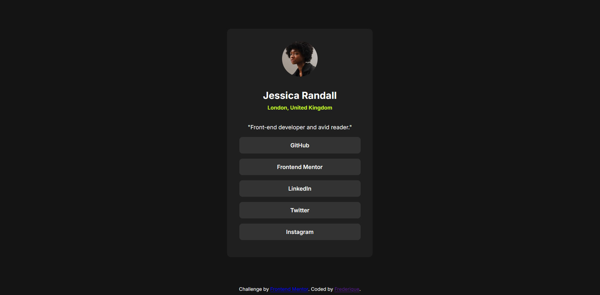

 🎯 Frontend Mentor - Défi "Social Links Profile"

Bienvenue sur mon challenge Frontend Mentor !  
J’ai recréé une carte de profil avec des liens vers différents réseaux sociaux, tout en respectant les consignes de design (desktop + mobile). C’était un super exercice pour progresser en HTML et CSS.

 🖼️ Aperçu

Voici un aperçu du projet :  

 🚀 Le défi

- Reproduire à l’identique la maquette (desktop + mobile)
- Centrer la carte aussi bien horizontalement que verticalement
- Ajouter des effets de survol ("hover") sur les boutons
- Rendre la page "responsive" (mobile + desktop)
- Respecter les polices, couleurs du style-guide

 🔗 Liens utiles

- 💻 Code source : [Voir sur GitHub](https://github.com/oxford777/social-links-profile)
- 🌍 Site en ligne : [Voir le site en direct](https://oxford777.github.io/social-links-profile/)

 🛠️ Outils utilisés

- HTML5 pour la structure
- CSS3 (Flexbox + "clamp()")
- Google Fonts (Inter)

 📚 Ce que j’ai appris

J’ai vraiment appris plein de choses simples mais essentielles :
- Centrer un élément en CSS (et ce n’est pas si évident 😄)
- Utiliser "clamp()" pour adapter les tailles sans casser le design
- Ajouter des effets de "hover" 
- Bien utiliser target="_blank" avec rel="noopener noreferrer" pour ouvrir les liens en toute sécurité

 🔄 À améliorer plus tard

- Gérer un thème sombre/clair
- Une meilleure accessibilité 

 📚 Ressources utiles

- [MDN - clamp()](https://developer.mozilla.org/fr/docs/Web/CSS/clamp)
- [MDN - Flexbox](https://developer.mozilla.org/fr/docs/Web/CSS/CSS_flexible_box_layout)
- [Google Fonts - Inter](https://fonts.google.com/specimen/Inter)

 👩‍💻 À propos de moi

Je m’appelle Frédérique et je suis en apprentissage en développement web.

- GitHub : [@oxford777](https://github.com/oxford777)
- Frontend Mentor : [@oxford777](https://www.frontendmentor.io/profile/oxford777)

## 🙏 Merci !

Merci à Frontend Mentor pour ces super projets bien pensés.  
Ils m’aident à progresser pas à pas, en me confrontant à de vrais défis. 👩‍💻✨
